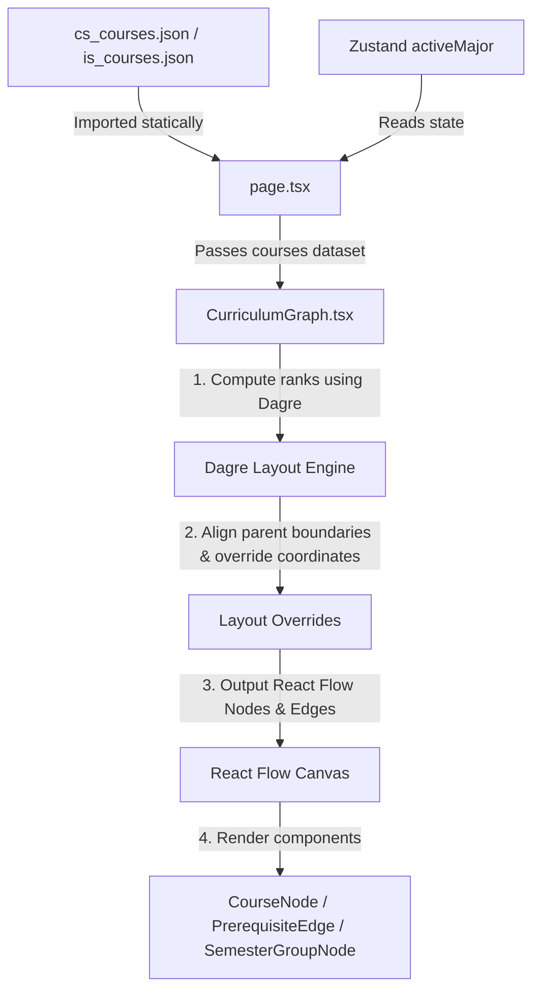

# Technical Documentation: CS/IS Course Visualizer

## 1. Executive Summary
The CS/IS Course Visualizer is an interactive web application designed to map, structure, and visualize the curriculum paths for the Computer Science (CS) and Information Systems (IS) departments of Universitas Indonesia. It provides a visual Directed Acyclic Graph (DAG) representing courses as nodes and prerequisite requirements as edges. This enables users (students, academic advisors, and developers) to inspect course flows, semester structures, credit requirements, and prerequisites in an interactive, zoomable, and filterable canvas interface.

The application executes entirely within the client-side **Browser runtime environment**, requiring no dedicated backend database or server side rendering (SSR) API handlers. Built on the **Next.js App Router** framework, it is configured for a **Static Site Generation (SSG)** export (`output: 'export'`), rendering the application into flat, optimized HTML, CSS, and JavaScript files during build time. The architecture acts as a highly optimized Single Page Application (SPA) utilizing client-side memory structures for graph computations, state synchronization, and fuzzy searching.

---

## 2. Technology Stack

| Category | Component / Library | Version | Description |
| :--- | :--- | :--- | :--- |
| **Core Framework & Language** | Next.js | `14.2.22` | React framework configured with App Router and static export capabilities. |
| | React | `^18.x.x` | Core UI rendering engine. |
| | TypeScript | `^5.x.x` | Static type safety and data structuring. |
| **UI & Styling** | Tailwind CSS | `^3.4.1` | Utility-first CSS styling framework. |
| | Lucide React | `^1.22.0` | Vector icon system. |
| **Graphing & Layout** | React Flow | `^11.11.4` | Interactive node-based canvas graphing engine. |
| | Dagre | `^3.0.0` | Directed graph layout library for positioning nodes. |
| **State & Data Store** | Zustand | `^5.0.14` | Minimal, fast, and light state store for application controls. |
| **Search Engine** | Fuse.js | `^7.4.2` | Client-side lightweight fuzzy search library. |
| **Tooling** | PostCSS / ESLint | `^8.x.x` | CSS compilation and code styling verification. |

---

## 3. Directory Structure & Module Boundaries

```
csui-course-visualizer/
├── .github/                 # CI/CD deployment pipelines (GitHub Actions)
├── MD_FILES/                # Technical documentation files
│   └── TECHNICAL_DOCUMENT.md# (This file) Comprehensive architectural documentation
├── public/                  # Static assets (favicons, public assets)
├── src/
│   ├── app/                 # Next.js App Router routes and configuration
│   │   ├── favicon.ico
│   │   ├── layout.tsx       # Root layout wrapper with global font configurations
│   │   └── page.tsx         # Main entry point SPA dashboard home page
│   ├── components/          # Reusable React components and custom React Flow elements
│   │   ├── CourseDrawer.tsx # Slide-out info panel displaying course syllabus
│   │   ├── CourseNode.tsx   # Custom React Flow component representing a course card
│   │   ├── CurriculumGraph.tsx # Main workspace canvas managing Dagre layout
│   │   ├── PrerequisiteEdge.tsx # Custom edge arrow with interactive stacked labels
│   │   ├── SemesterGroupNode.tsx # Ivory dashed group boundary nodes
│   │   ├── SemesterSidebar.tsx # Left panel selector filtering active semesters
│   │   └── TopNav.tsx       # Top bar containing search queries and major selector
│   ├── data/                # Static JSON files housing course data
│   │   ├── cs_courses.json  # Comprehensive CS syllabus data
│   │   └── is_courses.json  # Comprehensive IS syllabus data
│   ├── store/               # Zustand global store configuration
│   │   └── useCurriculumStore.ts # Central state for majors, query, and selections
│   └── types/               # TypeScript interfaces and custom data types
│       └── curriculum.ts    # Syllabus structures, course details, and states
├── next.config.mjs          # Next.js builder configuration
├── tailwind.config.ts       # Utility styling design system tokens
└── tsconfig.json            # Strict TypeScript compilation rules
```

### Module Boundaries
* **`src/app`**: Entry boundary. Prepares fonts, registers global providers (like `ReactFlowProvider`), loads static JSON files, and renders the static page wrapper.
* **`src/store`**: State boundary. Exposes the Zustand hook `useCurriculumStore` which acts as the source of truth for global dashboard interactions.
* **`src/components`**: Presentation and Visualization boundary. Interacts with React Flow APIs, calculates layout changes using Dagre, handles local click actions, and renders interactive components.
* **`src/data`**: Data layer. Read-only schema-validated JSON files acting as the static database for the application.

---

## 4. Core Architecture & Data Flow

### Data Loading Strategy
Since the site builds into a static export, all data is loaded synchronously at initial load:
1. **Raw JSON Import:** The main page in [page.tsx](file:///c:/dev/csui-course-visualizer/src/app/page.tsx) statically imports `cs_courses.json` and `is_courses.json`.
2. **Conditional Major Filtering:** A `useMemo` hook evaluates the active major selected in the Zustand store (`activeMajor`) and outputs the corresponding dataset to the canvas.

### State Store & Mutation
Global state is managed via **Zustand** inside [useCurriculumStore.ts](file:///c:/dev/csui-course-visualizer/src/store/useCurriculumStore.ts). The store manages the following properties:
* `activeMajor`: `'CS' | 'IS'` - Toggles active dataset.
* `selectedCourseId`: `string | null` - Highlights prerequisite paths of a selected course.
* `searchQuery`: `string` - Triggers fuzzy search indexing.
* `highlightedNodes`: `Set<string>` - Active nodes lying on the prerequisite path.
* `selectedSemester`: `string | null` - Filters nodes belonging to a specific semester.

```typescript
// Zustand Store Interface
interface CurriculumState {
  activeMajor: 'CS' | 'IS';
  selectedCourseId: string | null;
  searchQuery: string;
  highlightedNodes: Set<string>;
  selectedSemester: string | null;
  setActiveMajor: (major: 'CS' | 'IS') => void;
  setSelectedCourseId: (id: string | null) => void;
  setSearchQuery: (query: string) => void;
  setHighlightedNodes: (nodes: Set<string>) => void;
  setSelectedSemester: (semester: string | null) => void;
}
```

### Rendering Pipeline
The application uses a Hybrid Client-Side Rendering Strategy:


---

## 5. Key Subsystems & Components

### 1. The DAG Layout Engine (Dagre & Layout Overrides)
**Responsibility:** Automatically computes nodes positioning to prevent overlaps, layouts semesters vertically, and packs elective choices.
* **Core File:** [CurriculumGraph.tsx](file:///c:/dev/csui-course-visualizer/src/components/CurriculumGraph.tsx)
* **Algorithms & Logic:**
  1. **Compound Setup:** Configures a Dagre graph using `{ rankdir: 'TB', nodesep: 40, ranksep: 160 }`. It adds semester groups (`semester-1` to `semester-pilihan`) as parent nodes and courses as child nodes.
  2. **Layout Edges:** Populates Dagre with actual course prerequisite edges. For the CS major, it sets layout-only dummy edges (`semester-6` to `semester-7/8` and from `CSGE603229` to `CSGE604097/CSGE604099` in IS) to structure container dependencies.
  3. **Manual Sibling Packing:** After Dagre executes, sibling course nodes are sorted by their X coordinates and packed tightly using a custom `40px` gap rather than raw coordinates.
  4. **Coordinate Alignment Overrides:** Overrides horizontal and vertical offsets of Semesters 6, 7, and 8 relative to the Pilihan matrix. This aligns their top borders on the exact same horizontal line and places Semester 7 and 8 side-by-side beneath Semester 6 without overlaps.

### 2. Custom Edge Detour Router (Obstacle Avoidance)
**Responsibility:** Renders connections between courses while routing paths around unrelated semester containers to preserve visual clarity.
* **Core File:** [PrerequisiteEdge.tsx](file:///c:/dev/csui-course-visualizer/src/components/PrerequisiteEdge.tsx)
* **Algorithms & Logic:**
  * Checks if the line segment crosses any intermediate semester group bounding boxes (from `semesterBounds`).
  * If a vertical intersection is found, it calculates an orthogonal detour:
    ```typescript
    // Choosing side clearance detour X
    const detourX = distToLeft < distToRight ? minObsX - 40 : maxObsX + 40;
    // Step line points
    edgePath = `M ${sourceX} ${sourceY} L ${sourceX} ${yStep1} L ${detourX} ${yStep1} L ${detourX} ${yStep2} L ${targetX} ${yStep2} L ${targetX} ${targetY}`;
    ```
  * Otherwise, falls back to `getSmoothStepPath` default rendering.

---

## 6. Routing & Navigation
The application operates entirely on a **Single-Page Routing Paradigm** matching Next.js Static Export rules.
* **Main Route:** `/` mapped to [page.tsx](file:///c:/dev/csui-course-visualizer/src/app/page.tsx).
* **Navigation Flow:** Since there are no nested pages, the view switches entirely via client state changes inside Zustand:
  * Switching majors (`CS` $\leftrightarrow$ `IS`) resets graph coordinates, swaps data dependencies, and fits bounds.
  * Clicking a sidebar semester zooms the viewport to fit the specific semester group container card.
  * Selecting a course card slides out the [CourseDrawer](file:///c:/dev/csui-course-visualizer/src/components/CourseDrawer.tsx) from the right using CSS translate animations.

---

## 7. Known Technical Debt & Optimization Targets

1. **High Layout Overhead in `useMemo`:**
   * *Location:* [CurriculumGraph.tsx](file:///c:/dev/csui-course-visualizer/src/components/CurriculumGraph.tsx)
   * *Issue:* The layout recalculation loop (including Dagre execution and parent node grouping loops) is bound inside a single `useMemo` that triggers whenever `highlightedNodes`, `selectedCourseId`, or `selectedSemester` change.
   * *Solution:* Decouple the Dagre node positions compute phase from the active highlighting/edge color state evaluation, caching the base coordinate map separately.

2. **Hardcoded Layout Position Constants:**
   * *Location:* [CurriculumGraph.tsx](file:///c:/dev/csui-course-visualizer/src/components/CurriculumGraph.tsx) (override coordinate equations).
   * *Issue:* Aligns semesters by subtracting or adding fixed offset gaps (`pilihanLeftX - sem8Width - 80`). If the course count or elective column counts change dynamically, this override might lead to visual misalignment.
   * *Solution:* Implement a layout metadata schema defining column structures and vertical flow margins programmatically.
